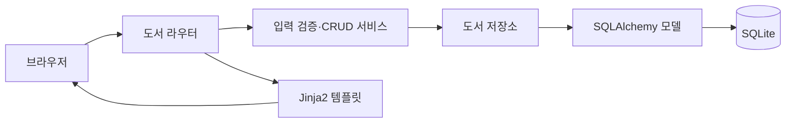

# 도서 기록 CRUD 서비스

## 프로젝트 소개

FastAPI, SQLAlchemy, SQLite, Jinja2로 만든 도서 기록 웹 애플리케이션입니다. 제목·저자·출판년도·메모를 등록하고 목록·상세·수정·삭제 화면에서 관리합니다.

## 핵심 특징

- 도서 등록·조회·검색·수정·삭제
- Jinja2 기반 서버 렌더링과 폼 제출 후 리다이렉트
- 서비스의 입력 검증과 저장소의 DB 접근 분리
- SQLite 자동 초기화와 로컬 데이터 영속 저장
- 잠금 파일을 이용한 개발 환경 재현

## 아키텍처

`라우터 → 서비스 → 저장소 → SQLAlchemy 모델 → SQLite` 흐름입니다. `src/book_records/main.py`가 앱과 테이블을 초기화합니다.

| 경로 | 역할 |
| --- | --- |
| `src/book_records/main.py`, `src/book_records/core/database.py` | 앱 생성과 DB 연결 |
| `src/book_records/routers/` | HTTP 요청과 화면 전환 |
| `src/book_records/services/` | 입력 검증과 CRUD 흐름 |
| `src/book_records/repositories/` | 세션 기반 조회·저장 |
| `src/book_records/models/` | 도서 ORM 모델 |
| `src/book_records/ui/templates/` | 공통 화면과 도서 화면 |
| `pyproject.toml`, `uv.lock` | 의존성 선언과 정확한 설치 버전 |



소스는 `src/book_records/`, 회귀 테스트는 `tests/`, 개발 보조 도구는 `scripts/`에 둡니다. `pyproject.toml`이 패키지·명령·개발 도구를 선언하고 `uv.lock`이 설치 버전을 고정합니다. `uv sync --frozen`은 소스를 개발 모드로 설치하므로 앱 실행과 테스트에 별도 `PYTHONPATH` 설정이 필요하지 않습니다.

## 실행 환경과 시작하기

Python 3.10 이상과 uv가 필요합니다. 명령은 저장소 루트에서 실행합니다.

```bash
uv sync --frozen
uv run --frozen uvicorn book_records.main:app --host 127.0.0.1 --port 8000
```

브라우저 주소는 `http://127.0.0.1:8000`입니다. 설치와 CI는 `pyproject.toml`과 `uv.lock`을 기준으로 합니다.

## 화면 경로

| 요청 | 기능 |
| --- | --- |
| `GET /` | 홈 |
| `GET /books` | 목록과 검색 |
| `GET /books/new`, `POST /books` | 등록 폼과 저장 |
| `GET /books/{book_id}` | 상세 |
| `GET /books/{book_id}/edit`, `POST /books/{book_id}/edit` | 수정 |
| `POST /books/{book_id}/delete` | 삭제 |

## 데이터와 실행 범위

소스 체크아웃에서는 저장소 루트의 `database.db`에 데이터를 저장합니다. 실행 디렉토리나 별도 환경 변수로 이 경로를 바꾸는 기능은 현재 없습니다. DB 파일은 Git에서 제외합니다. 앱을 종료한 후 파일을 복사해 백업합니다.

사용자 로그인·권한 관리는 구현하지 않은 로컬 CRUD 실습입니다. 데이터 모델과 동작 범위를 임의로 확장하지 않습니다.

## 검증

```bash
make check
make test
make smoke
make build
```

정적 검사 후 pytest의 임시 DB fixture와 FastAPI `TestClient`로 홈·목록·등록·조회·수정·삭제 흐름을 확인합니다. 제목·저자·메모 검색, 잘못된 ID의 조회·수정·삭제, 잘못된 수정 입력의 오류 표시와 기존 데이터 보존도 검사합니다. 원본 레포의 DB를 생성하거나 수정하지 않습니다.

`make check`는 정적 분석·포맷·문서 검사를, `make test`는 `uv run --frozen pytest -q`로 저장소의 전체 pytest suite를 실행합니다. `make smoke`는 같은 테스트 중 `smoke` 마커가 붙은 HTTP 확인을 선택합니다(`uv run --frozen pytest -q -m smoke`). 테스트는 임시 DB와 모의 HTTP 요청을 사용합니다. DB 장애·실제 브라우저 배치·모든 지원 Python 버전의 실행까지 검증하는 것은 아닙니다.
